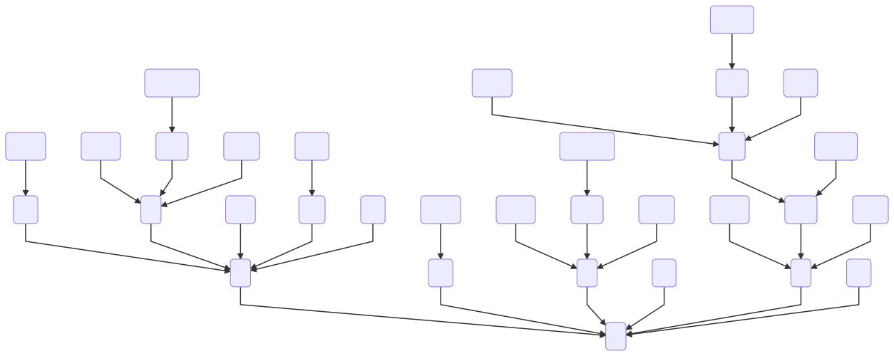

# On-the-fly irreps generation from solvable group chain

This page describes an algorithm to generate irreps for solvable groups {cite}`Neto:a09740`.

## Subduced and induced representations for solvable group

Let {math}`H` be invariant subgroup of {math}`G` such that {math}`G/H = \mathbb{Z}_{p}` ({math}`p` is prime and {math}`r^{p}=e`),
```{math}
  :label: decomp
  G = \coprod_{m=0}^{p-1} r^{m} H.
```
Consider projective irrep {math}`\Delta` with factor system {math}`\mu` for {math}`H`,
```{math}
  S \psi_{j} = \sum_{i=1}^{d} \psi_{i} \Delta(S)_{ij} \quad (R \in H, i = 1, \dots, d).
```
The following representations are also irrep over {math}`H`:
```{math}
  \Delta^{(m)}(S)
    &:= \frac{ \mu(S, r^{m}) }{ \mu(r^{m}, S_{m}) } \Delta(S_{m})
    \quad (S \in H, m = 0, \dots, p-1) \\
  S_{m}
    &:= r^{-m} S r^{m} (\in H)
```
There are two cases for {math}`\{ \Delta^{(m)} \}_{m=0, \dots, p-1}`:
1. They are mutually inequivalent: {math}`\Delta \uparrow G \downarrow H \cong \sum_{m=0}^{p-1} \Delta^{(m)}`
2. They are all equivalent: {math}`\Delta \uparrow G \downarrow H \cong p \Delta`

### Case-1: conjugated irreps are mutually inequivalent

For case-1, the induced representation {math}`\Delta \uparrow G` is irrep [^footnote1] [^footnote2]:
```{math}
  \Delta \uparrow G (r^{m} S)_{i:, j:}
    &= \mathbb{I}[i \equiv j + m] \frac{ \mu(r^{m}S, r^{j}) }{ \mu(r^{i}, S_{j} ) } \Delta( S_{j} )
    \quad (S \in H).\\
  \Delta \uparrow G (S)
    &= \begin{pmatrix}
      \Delta^{(0)}(S) & & & \\
      & \Delta^{(1)}(S) & & \\
      & & \ddots & \\
      & & & \Delta^{(p-1)}(S)
    \end{pmatrix}
    \quad (S \in H) \\
  \Delta \uparrow G (r)
    &= \begin{pmatrix}
      \mathbf{0} & \mathbf{0} & \mathbf{0} & \cdots & \mathbf{0} & \frac{\mu(r, r^{p-1})}{\mu(E,E)} \mathbf{1} \\
      \frac{\mu(r, E)}{\mu(r,E)} \mathbf{1} & \mathbf{0} & \mathbf{0} & \cdots & \mathbf{0} & \mathbf{0} \\
      \mathbf{0} & \frac{\mu(r, r)}{\mu(r^{2},E)} \mathbf{1} & \mathbf{0} & \cdots & \mathbf{0} & \mathbf{0} \\
      \vdots     & \vdots     & \vdots     &        & \vdots     & \vdots \\
      \mathbf{0} & \mathbf{0} & \mathbf{0} & \cdots & \frac{\mu(r, r^{p-2})}{\mu(r^{p-1},E)} \mathbf{1} & \mathbf{0}
    \end{pmatrix}.
```

### Case-2: conjugated irreps are equivalent

[^footnote1]: This follows from Frobenius reciprocity theorem. In this case, {math}`\Delta` appears only once in {math}`\Gamma \downarrow H`.
Thus, {math}`\Gamma` appears only once in {math}`\Delta \uparrow G`.

[^footnote2]: We can choose factor system to satisfy {math}`\mu(E, R) = \mu(R, E) = 1 (\forall R \in G)`, and then {math}`\Delta^{(0)} = \Delta`

For case-2, the induced representation {math}`\Delta \uparrow G` is reducible.
Let one of intertwiner between {math}`\Delta^{(0)}` and {math}`\Delta^{(1)}` be {math}`\mathbf{U}`,
```{math}
  \mathbf{\Delta}^{(0)}(S) \mathbf{U} = \mathbf{U} \mathbf{\Delta}^{(1)}(S)
  \quad (\forall S \in H).
```
The intertwiner is unique up to scalar multiplication: if {math}`\mathbf{U}` and {math}`\mathbf{U}'` are intertwiner between {math}`\Delta^{(0)}` and {math}`\Delta^{(1)}`, {math}`\mathbf{U}^{-1}\mathbf{U}'` should be written as {math}`c\mathbf{I}` with some complex number {math}`c` from Schur's lemma.
See {ref}`this page <intertwiner>` for numerical way to obtain {math}`\mathbf{U}`.
We scale {math}`\mathbf{U}` such that {math}`\mathbf{U}^{p} = \mathbf{1}`.

The induced representation {math}`\Delta \uparrow G` is decomposed to {math}`p` irreps {math}`\{ \Delta_{q} \}_{q=0}^{p-1}`,
```{math}
  \mathbf{\Delta_{q}}(S) &= \mathbf{\Delta}(S) \quad (S \in H) \\
  \mathbf{\Delta_{q}}(r) &= \frac{1}{\omega_{q}} \mathbf{U} \\
  \omega_{q}
    &:= \left( \frac{\prod_{m=1}^{p-1} \mu(r, r^{m})}{\mu(E, E)} \right)^{\frac{1}{p}} \exp \left( \frac{2 \pi i q}{p} \right).
```

## Decomposition of crystallographic point groups

A crystallographic point group {math}`G` can always be decomposed as Eq. {eq}`decomp` because it is a solvable group.
spgrep adapts the following decomposition {cite}`ITA2016`:



## References

```{bibliography}
:filter: docname in docnames
```
